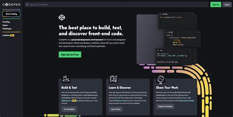

## About 
This project, Webbie, is about teaching the basics of web development in a fun and engaging way. We want to introduce students to HTML and CSS through an interactive platform that shows them step-by-step how to design the structure of a website and how to add customizations such as changing font size or font color, adding buttons, and embedding links or images. 
## Description 
* <b>Difficulty Level</b>: Beginner 
* <b>Target Audience</b>: 1st grade - College 
* <b>Duration of Workshop</b>: 1 hour 
* <b>Needed Materials</b>: Computers, Codepen.io. 
* <b>Learning outcomes</b>: The primary goals of this project is to introduce the students to the basics of HTML and CSS, and demonstrate how we could use them to design a webpage.
* [TAP](https://ggc.edu/academics/school-of-science-and-technology/research-internships-service-learning/technology-ambassador-program) (Technology Ambassadors Program) is a project-based class that provides a collaborative environment for students to work with their fellow classmates on a semester-long project using technologies of their choice. TAP strives to increase participation in IT through numerous outreach activities and workshops that are designed to showcase the creative and fun side of technology.

[Commercial Video](https://github.com/user-attachments/assets/f3876054-5480-45ac-bf06-b36a356564ec)

## Team 
* Holly Boaz
* April Factor
* Thien Trung (Trump) Dong Dong 

## Advisors
* Dr. Wei Jin 
* Dr. Xin Xu 
## Team Photo

(From left to right: April Factor, Holly Boaz, Trump Dong Dong) 

## Game Description 

## Publications 
1. Holly Boaz, April Factor, Thien Trung Dong Dong. "Webbie", CREATE Symposium, November 11th, 2022, Georgia Gwinnett College. 
## Outreach Activities
1. <b>TAP Expo</b>, Georgia Gwinnett College, October 11th, 2022 - Promote IT fields among college students. 
2. <b>Explore Your Future Career</b> event organized by the Gwinnett County Public Schools, October 15th, 2022, Discovery High School - Project Demo.
3. <b>CREATE Symposium</b>, Georgia Gwinnett College, November 11th, 2022. 

## Similar Projects 
If you're interested in other projects that are related to webpage development, you can check out [Foe](https://github.com/TAP-GGC/Foe) which teaches the basics of JavaScript!
[Space Mechanic](https://github.com/TAP-GGC/SpaceMechanic/blob/main/README.md) is another intro-level programming project (using Scratch) you may want to check out. 
## Technology

  

* HTML (Hypertext Markup Language) is the standard markup language for structuring and defining the content of a webpage or a website, which is a collection of webpages.

  

* CSS (Cascading Style Sheet) is a style sheet language used for designing visual elements of a webpage or website such as background color, text color, or font size.

  

* [CodePen](https://codepen.io/) is a online code editor for front-end development that supports HTML, CSS, and JavaScript. 

## Project Setup/Installation 
## Short Demo Instruction 
## Workshop Instruction 
## Usage
